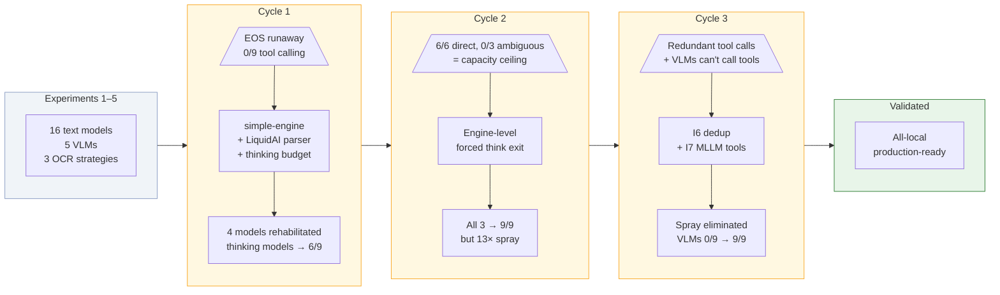

# Experiment Consolidation: vllm-mlx Research Phase

_Date: 2026-02-25 (v2)_
_Scope: 7 experiments + 2 fork validations (I6, I7) + Nanbeige multi-run + HF survey + Pro retest_
_Fork: 219cfda (phase/p1 HEAD)_
_Status: Research phase COMPLETE_

---

## Executive Summary

Over 7 experiments spanning 3 weeks, we evaluated 20+ models across text reasoning, tool calling, vision, OCR augmentation, and cloud comparison to determine the optimal local inference architecture for an interactive application on Apple Silicon (M2 Max, 96 GB).

**The answer**: An all-local architecture is viable and production-ready. No cloud dependency is required for the core interaction loop.

| Role | Model | Speed | Tools | RAM | Why |
|------|-------|------:|:-----:|----:|-----|
| Text reasoning + tools | Qwen3-4B-Instruct | 107 tok/s | 9/9 | 2.4 GB | Best quality (29/30), fastest text model with full tool calling |
| Vision + tools | ZwZ-8B-VL-4bit | 32 tok/s | 9/9 | 7.4 GB | Only local model with clean UI enumeration (17 elements, no degeneration) |
| Premium VLM | Qwen3-VL-30B-A3B-4bit | 48.6 tok/s | 9/9 | ~18 GB | MoE: 5x more vision depth than 4B VLMs, faster than dense 8B |
| Spatial grounding | CoreML Vision OCR | native | — | — | Selective OCR (≤2.3K chars) for interactive elements |

**How we got here**: This wasn't a straight-line benchmarking exercise. The research had two interleaved threads — **model evaluation** and **engine development** — that fed each other through 4 full iteration cycles. Testing models revealed engine limitations; fixing those limitations revealed new model capabilities; those capabilities exposed the next limitation. We started by asking "which models can even run well on Apple Silicon?" and ended by proving that local models match or exceed cloud frontier models on every metric that matters for interactive applications — while running at zero latency on unified memory. Seven models that were initially eliminated were rehabilitated through this process. (See [The Frontend–Backend Feedback Loop](#the-frontendbackend-feedback-loop) for the full co-evolution story.)

---

## The Questions That Drove the Research

The experiments followed a natural progression: each answer raised the next question. This is the story spine — the sequence of questions that turned a model benchmarking exercise into an architectural conclusion.

| # | Question | Short Answer | Experiment |
|:-:|----------|--------------|:----------:|
| 1 | **Which text models work best on Apple Silicon?** | Qwen3-4B: 107 tok/s, 29/30 quality, 9/9 tools. MoE models run faster than dense. | [Exp 1](#experiment-1-text-model-benchmarks) |
| 2 | **Do VLMs sacrifice text quality for vision?** | No — they match or beat text-only at the same parameter count. A VLM can be a general-purpose model. | [Exp 2](#experiment-2-vlm-vs-text-quality) |
| 3 | **Which VLMs can actually detect UI elements?** | Only ZwZ-8B. All 4B VLMs degenerate into repetition loops. This is unfixable at inference time. | [Exp 3](#experiment-3-vlm-vision-benchmarks) |
| 4 | **Can OCR text help smaller VLMs avoid degeneration?** | Partially. ZwZ-4B + selective OCR works for simple panels. But the 4B capacity limit is structural. | [Exp 4](#experiment-4-coreml-ocr-augmentation) |
| 5 | **Can we skip the VLM entirely and just use OCR + text?** | For value lookups yes, but not for state detection or spatial targeting. VLM image-only is actually fastest. | [Exp 5](#experiment-5-ocr-text-only-vs-vlm) |
| 6 | **Can engine-level fixes rehabilitate broken models?** | Yes — the fork fixed EOS, enabled thinking-model tools (6/9 → 9/9), deduplicated spray, and unlocked VLM tool calling. | [Exp 6](#experiment-6-model-re-evaluation-with-fork-fixes) |
| 7 | **Can frontier cloud models do what local can't?** | No. Cloud flash under-enumerates. Cloud Pro is more thorough but 10-100x slower. Local matches cloud on tools and reasoning. | [Exp 7](#experiment-7-cloud-gemini-comparison) |

**The meta-finding**: We asked "do we need the cloud?" and the answer was no — not because cloud models are bad, but because the latency cost (10-100s per call) destroys the interactive UX that makes a local interactive application valuable in the first place. The models are good enough locally. The architecture is the differentiator.

---

## Infrastructure Illusions: The Frontend–Backend Feedback Loop

Early in this project, the data told a clear story: most models were broken. They looped endlessly, ignored tool schemas, or crashed mid-generation. We documented them as eliminated and moved on.

But a pattern kept nagging. Models that *should* have worked — that had the right training, the right architecture, the right chat templates — were failing in ways that didn't match their specifications. WaveCut LFM2.5, at 333 tok/s, was the fastest model we'd tested. It understood tool calls. But the server couldn't parse its output format. Was it the model's fault, or the engine's?

**The answer changed everything.** Most of the constraints we'd observed in Experiments 1-5 weren't model limitations — they were *infrastructure* limitations masquerading as model limitations. Recognizing this launched a co-evolution between model evaluation (frontend) and engine development (backend) that would rehabilitate 7 models over 4 iteration cycles.

The pattern was always the same: test models, hit a wall, realize the wall is in the engine, write a spec, get a fix, re-test, discover the *next* wall. Each fix didn't just solve the immediate problem — it made the next limitation visible for the first time.



Each cycle followed the same rhythm: a **wall** (top, what we hit), a **fix** (middle, what the backend built), and a **result** (bottom, what it unlocked). The walls are as important as the fixes — they're the moments where the data forced us to question whether we were testing models or testing infrastructure.

**The four cycles:**

| Cycle | Experiments | Wall | Fix | What It Unlocked |
|:-----:|:----------:|------|-----|------------------|
| **1** | [Exp 6 Arm A](#experiment-6-model-re-evaluation-with-fork-fixes) | Models crash or loop endlessly. Thinking models emit tool calls inside reasoning blocks — the server can't see them. | simple-engine with correct EOS detection. LiquidAI tool parser. Thinking token budget cap. *(d890ef6)* | 4 previously-eliminated models work again. 3 thinking models reach 6/9 tool calling. WaveCut suddenly the fastest model in the roster at 333 tok/s. |
| **2** | [Exp 6 Arm B](#experiment-6-model-re-evaluation-with-fork-fixes) | 6/9 ceiling: perfect on structured prompts (6/6), zero on ambiguous ones (0/3). Small models can be the engine, but not the art director. | Engine-level forced think exit — stops the reasoning phase before it consumes the entire token budget. *(P1.10)* | All 3 thinking models reach 9/9. But at higher budgets, they spray 13-15 redundant tool calls per turn. |
| **3** | [Exp 6 I6+I7](#experiment-6-model-re-evaluation-with-fork-fixes) | Tool call spray wastes resources. Separately: VLMs have zero tool calling support — the MLLM engine never passes tool schemas to the model template. | I6: exact duplicate removal + burst collapse for tool calls. I7: tool parameters injected into VLM chat templates. *(219cfda)* | Spray eliminated. Both production VLMs go from 0/9 → 9/9. Image + tool calling works in a single API call. Single-model VLM deployment viable. |
| **4** | [Exp 7](#experiment-7-cloud-gemini-comparison) | *(No wall — local stack validated.)* Cloud comparison begins. | *(N/A — Experiment 7 tests cloud against local baseline.)* | Cloud flash under-enumerates and degenerates. Cloud Pro is thorough but 10-100× slower. Local architecture confirmed. |

**The impact — before and after:**

| Before (2 working) | | After (10 usable) |
|:-------------------:|:----------------------------:|:-------------------:|
| ✅ Qwen3-4B | | ✅ Qwen3-4B — 107 tok/s, 9/9 |
| ✅ ZwZ-8B-VL *(no tools)* | | ✅ ZwZ-8B-VL — 32 tok/s, 9/9 |
| ❌ WaveCut | | ✅ Qwen3-VL-30B — 48.6 tok/s, 9/9 |
| ❌ LFM-Thinking | **4 cycles of** | ✅ Qwen3-VL-4B — 84 tok/s, 9/9 |
| ❌ Nanbeige | **wall → fix → result** | ✅ ZwZ-4B-VL — 84 tok/s |
| ❌ Phi-4-mini | **———→** | 🔧 WaveCut — 333 tok/s |
| ❌ LFM-Instruct | | 🔧 LFM-Thinking — 156 tok/s |
| ❌ Qwen3-VL tools | | 🔧 Nanbeige — 239 tok/s |
| ❌ ZwZ-8B tools | | 🔧 Phi-4-mini — 112 tok/s |
| | | 🔧 LFM-Instruct — 128 tok/s |

**2 working models → 10 usable models.** Same hardware, same weights, same prompts — just a better engine underneath.

---

## Experiments

### Baseline: Experiments 1–5

*These five experiments established the initial model roster and discovered the walls that would drive the backend fork. They answer Questions 1-5 from the story spine.*

### Experiment 1: Text Model Benchmarks

| | |
|---|---|
| **Branch** | `project/text-bench` |
| **Question** | Which text models are best for Apple Silicon local inference? |
| **Models** | 16 across P/A/C tiers |
| **Key metric** | tok/s x quality score x tool calling |

**Findings**:
- **Qwen3-4B-Instruct** emerged as the daily driver: 107 tok/s, 29/30 quality, 9/9 tool calling, 2.4 GB RAM. Best overall balance.
- MoE models (A3B active params) run faster than dense 7B/14B on M2 Max — active parameter count matters more than total.
- DeepSeek-R1 scored zero on tool calling. Coder-specialist models (Qwen3-Coder) scored poorly on general assistant tasks.
- Several models had EOS/runaway issues (LFM2.5-Instruct, Phi-4-mini) — later fixed by Experiment 6.

**Decision**: Qwen3-4B-Instruct is the text daily driver. *(Still holds.)*

---

### Experiment 2: VLM vs Text Quality

| | |
|---|---|
| **Branch** | `project/text-bench-v2` |
| **Question** | Do VLMs sacrifice text quality for vision capability? |
| **Models** | 5 text + 5 VLM, matched by parameter size |

**Expectation**: Adding vision capability to a language model should come at a cost — either in text quality, speed, or both. We expected to need separate models for text and vision.

**What actually happened**:
- VLMs do NOT sacrifice text quality. At 4B: identical scores (8.0 vs 8.0). At 7-8B: VLMs actually *score higher* (7.5 vs 6.0).
- VL architecture overhead on throughput: -17% at 4B, -23% at 7-8B, +13% at 12-14B (larger models amortize the overhead).
- This means a VLM can serve as a general-purpose model without needing a separate text-only model for non-vision tasks.

**Decision**: VLMs are viable as general-purpose models, not just vision specialists. *(Reinforced by I7 — VLMs now also do tool calling.)*

---

### Experiment 3: VLM Vision Benchmarks

| | |
|---|---|
| **Branch** | `feature/vlm-benchmark-tier-v` |
| **Question** | Which VLMs are best at UI element detection and vision tasks? |
| **Models** | 5 VLMs across P/A/V tiers + Round 2 UI detection |

**Findings**:
- **ZwZ-8B-VL** is the only model that produces useful UI element enumeration: 821 tokens, 17 elements, clean natural stop. No repetition.
- All 4B VLMs degenerate on the UI enumeration prompt — structural repetition loops hitting the 2048 token cap. This is a model capacity issue, not tunable via `repetition_penalty` (which actually makes it worse by penalizing legitimate structural tokens).
- Resolution limits: 1920x1080 universally safe, 3840x2160 marginal, 5120x2880 crashes 3/5 models (Metal GPU SIGABRT).
- `frequency_penalty` does NOT fix VLM degeneration — 7 configurations tested, all loop. Confirmed as structural model capacity limitation.

**Decision**: ZwZ-8B is the VLM daily driver. 4B VLM degeneration is unfixable at inference time. *(Still holds. Cloud comparison in Experiment 7 reinforced this — even cloud flash-tier models either degenerate or under-enumerate.)*

---

### Experiment 4: CoreML OCR Augmentation

| | |
|---|---|
| **Branch** | `project/coreml-ocr-augment` |
| **Question** | Can OCR text improve VLM UI element detection? |
| **Design** | 3 arms: complex image, simple image, optimized selective OCR |

**Findings**:
- Selective OCR (≤2.3K chars of interactive elements only) enables ZwZ-4B to produce 16-element clean output at 61.5 tok/s. Without OCR, ZwZ-4B degenerates.
- Throughput penalty: ~0.6% per 100 chars of OCR context. Full-page OCR (>5K chars) causes timeouts.
- ZwZ-8B is the safe fallback: 37.5 tok/s with selective OCR, never degenerates regardless of OCR length.
- Qwen3-VL-4B excluded — structural degeneration persists even with OCR augmentation.
- Apple Vision framework + AppKit accessible directly from Swift scripts (`import Vision`), no compilation needed.

**Decision**: Selective OCR is the right middle ground. ZwZ-4B + OCR for simple panels, ZwZ-8B as fallback for complex scenes. *(Still holds.)*

---

### Experiment 5: OCR Text-Only vs VLM

| | |
|---|---|
| **Branch** | `project/ocr-text-only` |
| **Question** | Can OCR + text-only LLM replace VLMs entirely for UI Q&A? |
| **Design** | 3-way: text-only (OCR input), VLM+OCR, VLM image-only. 5 Q&A scenarios. |

**Expectation**: A text-only model with OCR data should outperform a VLM that has to process raw pixels. More explicit structured input should mean better answers.

**What actually happened** — the counterintuitive result that reshaped the architecture:
- Text-only works for value lookups (font size, font family) but fails on state detection ("is this selected?") and precise targeting ("click coordinates for X").
- Text model state detection is non-deterministic even at `temperature=0` — self-contradicts across queries on the same OCR data. It pattern-matches rather than reasons.
- **VLM image-only is fastest**: 2.0s average, correct on 4/5 tests. Adding OCR to VLM adds latency without improving Q&A accuracy. The path with *less input* was both faster and more accurate.
- Two-tier routing validated: regex on keywords (state, action, click → VLM), everything else → text-only. Keyword-based, not LLM self-assessment (which is unreliable).

**Decision**: VLM image-only is the default Q&A path. Text-only for read-only value lookups via keyword router. *(Still holds.)*

**The baseline picture at this point**: Qwen3-4B for text, ZwZ-8B for vision, and a pile of eliminated models. But the pattern of EOS crashes and hidden tool calls across otherwise-capable models was too consistent to be coincidence. Something was wrong with the server, not the models.

---

### The Fork Iterations: Experiment 6 (Cycles 1–3)

*This is where the [infrastructure illusions](#infrastructure-illusions-the-frontendbackend-feedback-loop) played out. Each arm of this experiment corresponds to a cycle from the feedback loop above. It answers Question 6: "Can engine-level fixes rehabilitate broken models?"*

### Experiment 6: Model Re-evaluation with Fork Fixes

| | |
|---|---|
| **Branch** | `project/model-reeval` |
| **Question** | Were the eliminated models actually broken, or was the server? |
| **Design** | 4 arms: d890ef6 (3 fixes) → P1.10 (engine-level think exit) → I6 (spray dedup) → I7 (MLLM tools) |

This was the longest experiment (27 commits), spanning multiple fork iterations — and the one that reframed the entire project. The infrastructure illusions discovered here meant that every "eliminated" model deserved a retrial.

**Cycle 1 → Arm A — simple-engine (d890ef6)**:
- **Wall**: Models crash or loop. Tool calls hidden inside `<think>` blocks.
- **Fix**: `--runtime-mode auto` fixes EOS for LFM-Instruct, Phi-4-mini, LFM-Thinking, and short-context Qwen3-VL-4B. LiquidAI parser + thinking budget cap expose hidden tool calls.
- **Result**: WaveCut DWQ becomes fastest model tested: 239-333 tok/s. Three thinking models reach 6/9 tool calling. 6/9 ceiling identified: 6/6 on direct/structured probes, 0/3 on ambiguous. Small models are engines, not art directors.

**Cycle 2 → Arm B — P1.10 (engine-level forced think exit)**:
- **Wall**: 6/9 ceiling — ambiguous probes exhaust the thinking budget before the model reaches a tool call.
- **Fix**: Engine-level forced think exit stops the reasoning phase at the budget boundary.
- **Result**: All 3 thinking models reach 9/9 at model-specific budgets (WaveCut=64, LFM=128, Nanbeige=256). But at higher budgets, spray pattern emerges: 13-15 redundant tool calls per turn.

**Cycle 3 → I6 + I7 Validations**:
- **Wall (I6)**: Tool call spray wastes resources. **Wall (I7)**: MLLM engine never passes tool schemas to VLM templates — VLMs structurally can't call tools.
- **Fix (I6)**: Exact duplicate removal + burst collapse. **Fix (I7)**: Tool parameters injected into VLM chat templates.
- **Result (I6)**: WaveCut budget-256 fixed (0/3 → 3/3, 2 clean calls). LFM-Thinking clean at 256 (1 call). All models converge on budget-256. Nanbeige: 3/5 = 60% pass rate (inherent 3B non-determinism, not I6 regression).
- **Result (I7)**: Both VLMs go from 0/9 → 9/9 tool calling. Qwen3-VL at 0.86s avg, ZwZ-8B at 1.12s avg. Image + tool mixed request works in a single API call. Single-model VLM+tool deployment now viable.

**Decision**: Fork at 219cfda is validated production-ready. simple-engine + I6 dedup + I7 MLLM tools = the complete fix set. *(Final.)*

---

### External Validation: Experiment 7 (Cycle 4)

*With the local stack validated through Cycles 1-3, the final question was whether cloud frontier models could do something local couldn't. This answers Question 7 from the story spine.*

### Experiment 7: Cloud Gemini Comparison

| | |
|---|---|
| **Branch** | `project/cloud-gemini-compare` |
| **Question** | Can frontier cloud models do what local can't? |
| **Models** | Flash: gemini-2.5-flash, flash-lite, gemini-3-flash-preview. Pro: gemini-2.5-pro, gemini-3-pro-preview, gemini-3.1-pro-preview |
| **Design** | Two retests matching local 4-tier methodology (flash + pro), after iteration 1 was invalidated for methodological flaws |

**Flash Retest Findings**:
- **Tool calling**: All 3 flash models score 9/9. Post-I7, local VLMs also score 9/9 — gap closed.
- **VLM degeneration**: flash-lite degenerates identically to local 4B VLMs (fabricated JSON with incrementing coordinates). Strongest cross-platform evidence that degeneration is a parameter-scale issue.
- **V1 under-enumeration**: flash and flash-preview stop too early (~80 tokens, 2-3 elements vs ZwZ-8B's 821 tokens, 17 elements). No flash model matches ZwZ-8B on V1.
- **Latency**: 10-12s per VLM call. Prohibitive for interactive applications.

**Pro Retest Findings** *(reviewed and corrected — original synthesis had incorrect V1 element counts)*:
- **Tool calling**: All 3 Pro models score 9/9. gemini-2.5-pro hallucinated C2 filter syntax (`"import requests in language:python"`); newer preview models produced clean args.
- **V1 vision (CORRECTED)**: All three Pro models overcome flash under-enumeration. Corrected element counts from raw data:
  - gemini-2.5-pro: 27 elements (1895 tokens, natural language, clean stop)
  - gemini-3-pro-preview: **60 elements** (1681 tokens, natural language, most efficient)
  - gemini-3.1-pro-preview: **~139 elements** (3424 tokens, JSON coordinate format, truncated at token limit)
  - *Note: Original Pro synthesis incorrectly reported 2 and 1 elements respectively, claiming "regression." The data shows the opposite — newer models are more thorough.*
- **Latency**: 11-21s for Tier A text, 29-103s for V1 vision. Strictly async.
- **Tier A**: All Pro models score 9/10 — marginal over flash 8/10.

**Decision**: All-local architecture is viable for the interactive application. Cloud is a fallback for tasks exceeding local capacity, not the default orchestration layer. Pro-tier adds V1 depth (27-139 elements) at massive latency cost — useful for async layout auditing but not real-time orchestration. *(Full analysis in `gemini-comparison-section.md` + `pro/pro-synthesis-annotated.md` on the cloud-gemini-compare branch.)*

---

## Cross-Cutting Findings

These themes emerged across multiple experiments and represent the most durable conclusions.

### 1. VLM degeneration is a parameter-scale problem

Evidence from Experiments 3, 4, 6, and 7. Every 4B VLM tested — local MLX (Qwen3-VL-4B, ZwZ-4B), cloud (gemini-2.5-flash-lite) — degenerates on the UI enumeration prompt with identical structural symptoms. Not fixable by:
- `repetition_penalty` (makes it worse — Experiment 3)
- `frequency_penalty` (7 configs, all loop — Experiment 3)
- OCR augmentation (Qwen3-VL still degenerates — Experiment 4)
- Cloud hosting (flash-lite fails the same way — Experiment 7)

Only fixable by using >=8B parameters (ZwZ-8B) or selective OCR augmentation with specific models (ZwZ-4B + OCR in Experiment 4). **MoE models partially solve this**: Qwen3-VL-30B-A3B (30B total / 3B active, HF survey) produces ~2.5K tokens of clean enumeration before degeneration onset — 5x more than dense 4B models. More total parameters = more knowledge depth, even though per-token compute is equivalent.

### 2. Tool calling quality correlates with model scale, not architecture

| Model Class | Tool Calling Score | Evidence |
|---|---|---|
| >=4B general-purpose | 9/9 | Qwen3-4B (Exp 1), all cloud models (Exp 7) |
| >=4B VLM (post-I7) | 9/9 | Qwen3-VL, ZwZ-8B (Exp 6 I7) |
| MoE VLM (30B/3B-active) | 9/9 | Qwen3-VL-30B-A3B (HF survey) |
| 1.2-3B thinking models | 6/9 -> 9/9 with budget tuning | WaveCut, LFM, Nanbeige (Exp 6) |
| 1.2-3B thinking models (ambiguous probes) | 60% reliable | Nanbeige multi-run |
| Non-thinking small models | 0/9 | Phi-4-mini, LFM-Instruct (Exp 1, 6) |
| gemma-3 (all sizes) | 0/9 | gemma-3-4b, gemma-3-12b (HF survey) — no structured tool output |

The structured vs unstructured split (6/6 direct, 0/3 ambiguous at 1.2-3B) is a model capacity boundary, not an engine limitation. Small models are **engines** — they execute structured instructions flawlessly. But they can't be the **art director** — they lack the capacity to disambiguate vague user intent into precise tool parameters. This maps directly to a two-tier mediation architecture: a capable model (Qwen3-4B at 107 tok/s) interprets the user's intent, and an ultra-fast model (WaveCut at 333 tok/s) executes the structured result.

### 3. Selective OCR is universally the right strategy

Tested across local VLMs (Experiment 4), local text-only LLMs (Experiment 5), and cloud models (Experiment 7). In all cases:
- Full-page OCR causes timeouts or throughput collapse
- No OCR misses spatial grounding
- Selective OCR (interactive elements only, <=2.3K chars) is the sweet spot

The 5-6x throughput penalty for multimodal injection is consistent across local and cloud, ruling out framework-specific explanations.

### 4. VLMs don't sacrifice text quality

Experiment 2 showed VLMs match or exceed text-only models at the same parameter count. Combined with I7 (VLM tool calling), this means a single VLM can serve as a general-purpose model — no separate text-only model needed for the common case. Qwen3-4B remains the text daily driver for pure throughput (107 tok/s vs 32-84 tok/s for VLMs), but the architecture doesn't require it for quality reasons.

### 5. Small model behavior is stochastic

Experiments 1, 6, and the Nanbeige multi-run consistently showed that 1.2-3B parameter models have high run-to-run variance on identical inputs. Single-run tests are unreliable for this class. This isn't a bug — it's a fundamental property of small-scale language models operating near their capacity limits on complex tasks.

Production implication: retry logic at the application layer, not engine-level fixes.

### 6. The fork (219cfda) rehabilitated 7 models

| Fix | Models Rehabilitated | Mechanism |
|---|---|---|
| simple-engine (`--runtime-mode auto`) | LFM-Instruct, Phi-4-mini, LFM-Thinking, Qwen3-VL-4B (short) | EOS detection fix |
| LiquidAI parser + thinking budget (d890ef6) | WaveCut, LFM-Thinking, Nanbeige | Tool-call parsing for thinking models |
| I6 spray dedup | WaveCut (budget-256 viable) | Exact duplicate + burst collapse |
| I7 MLLM tool calling | Qwen3-VL, ZwZ-8B | Tool params passed to VLM template |

Without the fork, the production-ready roster would be just Qwen3-4B (text) and ZwZ-8B (vision, no tools). With the fork, we have 4 production-ready models and 5 rehabilitated models with varying tool capabilities.

---

## Final Model Roster

### Production Ready

| Model | Role | tok/s | Tools | RAM | Key Experiment |
|---|---|---:|:---:|---:|---|
| Qwen3-4B-Instruct | Daily driver (text) | 107 | 9/9 | 2.4 GB | Exp 1 |
| ZwZ-8B-VL-4bit | Daily driver (VLM) | 32 | 9/9 | 7.4 GB | Exp 3, I7 |
| Qwen3-VL-30B-A3B-4bit | Premium VLM (MoE) | 48.6 | 9/9 | ~18 GB | HF survey |
| Qwen3-VL-4B-Instruct-4bit | Fast VLM + tools | 58-84 | 9/9 | 3.1 GB | Exp 3, I7 |
| ZwZ-4B-VL-4bit | Fast VLM (short queries) | 50-84 | -- | 3.1 GB | Exp 3, 4 |

### Rehabilitated by Fork

| Model | tok/s | Tools | Serve Flags |
|---|---:|:---:|---|
| WaveCut LFM2.5-DWQ-4bit | 239-333 | 6/9 | `--tool-call-parser liquidai --reasoning-parser qwen3 --max-thinking-tokens 256` |
| LFM2.5-Thinking-8bit | ~156 | 6/9 | `--tool-call-parser liquidai --reasoning-parser qwen3 --max-thinking-tokens 256` |
| Nanbeige4.1-3B-8bit | ~239 | 6/9 (60% on ambiguous) | `--tool-call-parser auto --reasoning-parser qwen3 --max-thinking-tokens 256` |
| Phi-4-mini-instruct-4bit | 98-112 | 0/9 | Standard |
| LFM2.5-Instruct-bf16 | 103-128 | 0/9 | Standard |

### Eliminated

| Model | Reason | Experiment |
|---|---|---|
| gemma-3n-E4B | Upstream mlx_vlm structurally incomplete: 1709 missing AltUp params. Not just a config bug. | Exp 1, HF survey recheck |
| gemma-3-12b-it-qat-4bit | 0/9 tool calling — responds conversationally, no structured output format | HF survey |
| gemma-3-4b-it-qat-4bit | 0/9 tool calling — same as 12b, architecture family limitation | HF survey |
| Qwen3-VL-4B (long-context) | Structural degeneration at 2048+, all fp configs loop | Exp 3, 6 |
| Qwen2.5-VL-3B | Poor quality, slow | Exp 3 |
| DeepSeek-R1 | Zero tool calling | Exp 1 |
| Llama-3.2-3B | Weak tool calling (3/9) | Exp 1 |

---

## Resolved Questions

| Question | Answer | Source |
|---|---|---|
| Which text model for daily use? | Qwen3-4B-Instruct (107 tok/s, 29/30, 9/9) | Exp 1 |
| Which VLM for daily use? | ZwZ-8B-VL-4bit (32 tok/s, 17 elements, 9/9 post-I7) | Exp 3, I7 |
| Do VLMs sacrifice text quality? | No — match or exceed at same param count | Exp 2 |
| Can OCR fix 4B VLM degeneration? | Partially — ZwZ-4B + selective OCR works, Qwen3-VL doesn't | Exp 4 |
| Can text-only replace VLMs for UI Q&A? | Only for value lookups, not state/action | Exp 5 |
| Is VLM degeneration fixable at inference? | No — parameter scale problem, confirmed local + cloud | Exp 3, 6, 7 |
| Does the fork fix EOS issues? | Yes — simple-engine rehabilitates 4 models | Exp 6 |
| Can thinking models do tool calling? | Yes at 6/9 (9/9 with engine-level budget) | Exp 6 |
| Is I6 dedup safe? | Yes — effective for WaveCut, no regressions. Nanbeige failure was non-determinism. | Exp 6, multi-run |
| Can VLMs do tool calling? | Yes post-I7 — both 9/9, image+tool works | Exp 6 I7 |
| Is cloud needed for orchestration? | No — local matches cloud flash-tier on tools + reasoning | Exp 7 |
| Is cloud faster for interactive applications? | No — 10-103s latency per call is prohibitive | Exp 7 |
| Can Pro-tier cloud overcome V1 under-enumeration? | Yes — all 3 Pro models produce 27-139 elements, but at 29-103s latency | Exp 7 Pro retest |
| Is gemma-3n viable? | No — mlx_vlm structurally missing AltUp architecture (1709 params). Not just a config bug. | HF survey recheck |
| Is Nanbeige's 60% pass rate improvable? | No — budget sweep (256/384/512) shows 256 is optimal; higher budgets hurt. 60% is the 3B ceiling. | Nanbeige multi-run |
| Optimal thinking budget? | 256 for all 3 models post-I6 | Exp 6 |
| Safe image resolution? | 1920x1080 universal, 3840x2160 marginal, 5120x2880 crashes | Exp 3 |

---

## Architectural Implications

The research phase answers the core architectural question: **can a fully local inference stack support an interactive application on Apple Silicon?**

**Yes.**

The production architecture:

```
User Interaction
    |
    +-- Vision + Tool Calling ----> ZwZ-8B-VL (32 tok/s, 9/9 tools)
    |                                 Serve: --mllm --enable-auto-tool-choice --tool-call-parser auto
    |
    +-- Text Reasoning + Tools ----> Qwen3-4B-Instruct (107 tok/s, 9/9 tools)
    |                                 Serve: --enable-auto-tool-choice --tool-call-parser auto
    |
    +-- Spatial Grounding ---------> CoreML Vision OCR (selective, <=2.3K chars)
    |                                 Keyword router: state/action/click -> VLM, else -> text
    |
    +-- Deep Vision (premium) -----> Qwen3-VL-30B-A3B (48.6 tok/s, 9/9 tools)
    |                                 Serve: --mllm --enable-auto-tool-choice --tool-call-parser auto
    |                                 Cap max_tokens at 2048 to avoid degeneration
    |
    +-- Fast VLM (short tasks) ----> Qwen3-VL-4B or ZwZ-4B (58-84 tok/s)
                                      Max 500 tokens to avoid degeneration
```

All zero-latency, all on-device, all running on unified memory. Cloud is optional fallback for async heavy-lifting tasks (layout auditing, exhaustive UI inventories), not required for the core interaction loop.

---

## What Comes Next: The Multi-Step Agent Challenge

Everything tested so far has been single-turn: one prompt, one response, score it. Production agents don't work that way. They execute multi-step workflows — observe screen, decide action, execute tool, observe result, decide next action — where errors compound across turns.

This is the transition from **model evaluation** to **system evaluation**:

**What changes in multi-step testing:**
- **Cumulative reliability matters.** A model that's 95% correct per turn is only 77% correct after 5 turns and 60% after 10. The margin between 95% and 99% per-turn accuracy is the difference between a usable agent and a frustrating one.
- **Recovery matters more than accuracy.** Can the agent detect when a tool call failed and retry? Can it backtrack from a wrong observation? Single-turn probes don't test this.
- **Latency accumulates.** A 2-second tool call is fine once. Ten of them in sequence is a 20-second workflow that feels broken even if every step succeeds.
- **Context window management.** Multi-turn conversations grow. How does the model behave when the conversation history exceeds its comfortable range?

**What we bring from the research phase:**
- A validated model roster with known per-turn reliability characteristics
- Tool calling at 9/9 for all production models
- A keyword-based routing system that can dispatch to the right model per task type
- An understanding of where degeneration boundaries lie (and how to stay within them)

**What we need to build:**
- Agent loop harness that chains tool calls with observation-action cycles
- Cumulative reliability scoring (not just per-turn pass/fail)
- Real UI workflows as test scenarios (not synthetic probes)
- Error recovery and retry protocol testing

This is the next chapter of the project.

---

## Connecting to the Broader Literature

*Reserved. This section will be populated after a structured peer review of the research methodology, prompting strategies, and evaluation rubrics used in this project — incorporating findings from academic papers and cross-disciplinary review of our experimental protocols.*

*Key areas to connect:*
- *How our 4-tier benchmark design compares to established LLM evaluation frameworks*
- *Where our degeneration findings align with (or diverge from) published VLM failure mode research*
- *Best practices for multi-step agent evaluation from the agent benchmarking literature*
- *Rubric design and scoring methodology validation*

---

## Appendix: Source Index

| Experiment | Branch | Key Files |
|---|---|---|
| 1. Text Bench | `project/text-bench` | `benchmarks/scores.csv`, `benchmarks/compare.csv` |
| 2. Text Bench v2 | `project/text-bench-v2` | `benchmarks/comparison-report.md` |
| 3. VLM Bench | `feature/vlm-benchmark-tier-v` | `benchmarks/vlm-scores.csv`, `benchmarks/vlm-compare.csv` |
| 4. CoreML OCR | `project/coreml-ocr-augment` | `benchmarks/cross-arm-comparison.md` |
| 5. OCR Text-Only | `project/ocr-text-only` | `benchmarks/comparison.md` |
| 6. Model Reeval | `project/model-reeval` | `benchmarks/cross-arm-comparison.md`, `benchmarks/i6-validation/`, `benchmarks/i7-validation/`, `benchmarks/hf-survey/` |
| 7. Cloud Gemini | `project/cloud-gemini-compare` | `benchmarks/cloud-gemini-compare/gemini-comparison-section.md`, `pro/pro-synthesis-annotated.md`, `pro/pro-comparison.md` |
| Fork specs | n/a | `_docs/specs/liquidai-tool-parser.md`, `_docs/specs/thinking-budget-control.md`, `_docs/specs/mllm-engine-tool-calling.md` |
| HF Survey | `project/model-reeval` | `benchmarks/hf-survey/hf-survey-summary.md` |
| Nanbeige Multi-run | `project/model-reeval` | `benchmarks/i6-validation/nanbeige/nanbeige-multirun-summary.md` |
